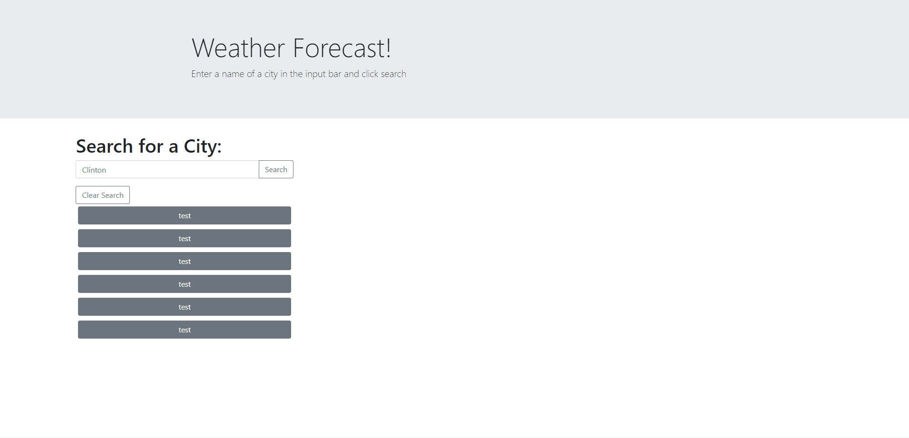

# Weather-Tracker:

A JavaScript based weather tracker that utilizes API's to gather weather data.

## Instructions for use:

- Enter a city name in the search bar and click the search button to fetch current weather data.
- Below the current weather data, a five day forecast will be displayed.
- Below the search bar, a list of previously searched cities will appear.
- Click on those cities to populate both current weather data and a five day forecast.
- Click on the clear search button to get rid of your previous searches.

## Langauges used:

- HTML
- CSS
- JavaScript

## Assets used:
- Bootstrap
- JQuery
- MomentJS

## API used:
- [Open Weather Map](https://openweathermap.org/api)
- Calls used: Current weather data, One Call API

## Demo

## License:

No license.

## Links:

-Link to my [GitHub](https://github.com/idpetersen)

-Link to deployed page [Click-Here!](https://idpetersen.github.io/weather-tracker/)